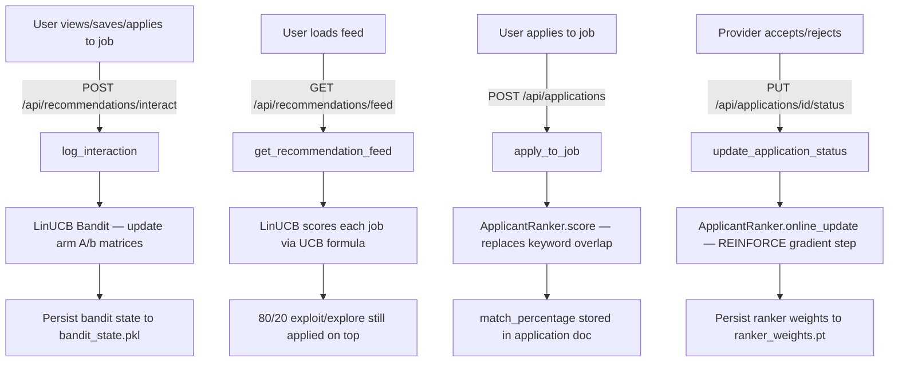

# InternX — RL Implementation Plan

## ✅ Laptop Compatibility Check

| Requirement | Status | Detail |
|---|---|---|
| Python 3.10.11 | ✅ Ready | `backend/venv` uses 3.10.11 |
| NumPy 2.2.6 | ✅ Ready | Already installed in venv |
| scikit-learn 1.7.2 | ✅ Ready | Already installed in venv |
| PyTorch 2.10.0+cpu | ✅ Ready | Already installed in venv |
| sentence-transformers | ✅ Ready | `all-MiniLM-L6-v2` already loading |
| APScheduler | ✅ Ready | Already used in `main.py` |
| GPU | ✅ Not needed | Both models are tiny (CPU is fine) |

> [!IMPORTANT]
> **Zero new packages needed.** Your venv already has everything. The only risk is using the wrong `pip` — always use `.\venv\Scripts\pip` inside `backend/`, never the global Anaconda pip (Python 3.13).

**One thing to verify before starting:**
```powershell
cd c:\Users\ayansh\InternX\backend
.\venv\Scripts\python.exe -c "import torch; import numpy; print('OK')"
```
If it prints `OK`, you're fully ready.

---

## 🗺️ Architecture Overview



---

## 📦 RL System 1 — LinUCB Job Recommender

### What changes
| File | Action |
|---|---|
| `backend/services/linucb_bandit.py` | **CREATE** — pure LinUCB class |
| `backend/services/recommendation_engine.py` | **MODIFY** — call bandit inside `get_recommendations()` |
| `backend/routes/recommendations.py` | **MODIFY** — trigger `bandit.update()` inside `/interact` |
| `backend/main.py` | **MODIFY** — load bandit state on startup, save on shutdown |

### How LinUCB works (non-mathy summary)

The current engine ranks jobs by **cosine similarity** — a fixed formula that never learns. LinUCB replaces this with a **self-improving formula**:

```
UCB_score(job) = expected_reward(job) + α × uncertainty(job)
```

- `expected_reward` = what the model **predicts** you'll like, based on past behavior
- `uncertainty` = how little data it has on this job — if it hasn't shown you this job type before, it explores it
- `α` (alpha) = exploration strength, set to `0.5`; increase for more exploration

**Context vector** for each (user, job) pair:
```
context = [user_preference_vector (vocab_size)] + [job_feature_vector (vocab_size)]
# Total: 2 × vocab_size dimensions
```

**Online update** (every time `/interact` is called):
- `reward` = `{view: 0.2, click: 0.5, apply: 1.0, like: 0.8}`
- Update the arm's `A` matrix and `b` vector with a single matrix multiply — takes < 1ms

**State storage** — in-memory dict keyed by `job_id`, serialized to `backend/bandit_state.pkl` on shutdown and reloaded on startup.

### `linucb_bandit.py` — full spec

```python
class LinUCBBandit:
    def __init__(self, context_dim: int, alpha: float = 0.5)
    
    def score(self, job_id: str, context: np.ndarray) -> float
    # Returns UCB score for a single job given context vector
    
    def update(self, job_id: str, context: np.ndarray, reward: float)
    # Online update of A and b for this job arm
    
    def save(self, path: str)
    def load(self, path: str)
    # Pickle-based persistence
```

**State per arm** (each job):
- `A`: `(d, d)` identity matrix initialized → grows with interactions
- `b`: `(d,)` zero vector → accumulates reward signals
- `theta_hat = A_inv @ b` → recomputed on each score call

### Integration into `recommendation_engine.py`

The `get_recommendations()` method currently does:
```python
similarities = cosine_similarity([user_vector], job_vectors)[0]
scores = (similarities * 100).astype(int)
```

After the change it will do:
```python
for job, job_vector in zip(valid_jobs, job_vectors):
    context = np.concatenate([user_vector, job_vector])   # (2d,)
    ucb_score = bandit.score(job_id, context)              # float
    cosine_score = cosine_similarity([user_vector], [job_vector])[0][0]
    # Blend: start cosine-heavy (new model), shift to bandit over time
    final_score = 0.4 * cosine_score + 0.6 * ucb_score
```

The 0.4/0.6 blend ensures **cold start safety** — cosine similarity still contributes until the bandit has enough data.

---

## 📦 RL System 2 — REINFORCE Applicant Ranker

### What changes
| File | Action |
|---|---|
| `backend/services/applicant_ranker.py` | **CREATE** — MLP + online REINFORCE |
| `backend/routes/applications.py` | **MODIFY** — `calculate_match_percentage()` calls ranker |
| `backend/routes/applications.py` | **MODIFY** — `update_application_status()` triggers `ranker.online_update()` |
| `backend/main.py` | **MODIFY** — load ranker weights on startup, save on shutdown |

### Feature vector (8 dimensions, no heavy ML needed)

```
[0] skill_overlap_ratio          # existing formula output, 0.0–1.0
[1] experience_match             # 1 if experience level matches job req, else 0
[2] resume_embedding_similarity  # cosine(resume_embedding, job_embedding), −1 to 1
[3] has_cover_letter             # 1/0
[4] skills_count_norm            # user total skills / 30 (normalized)
[5] job_skills_count_norm        # job required skills / 20
[6] education_level              # 0=none, 0.5=bachelor, 1.0=master/phd
[7] bio_job_overlap              # simple word overlap of user bio with job title
```

The 384-dim SentenceTransformer (`MLService`) is **already running** — feature [2] just calls `generate_embedding()` which is already cached.

### Network architecture

```
Input (8) → Linear(8→16) → ReLU → Linear(16→1) → Sigmoid → score ∈ [0,1]
```

Weight count: `8×16 + 16 + 16×1 + 1 = 161 parameters` — trains in microseconds.

### REINFORCE / online update

When provider calls `PUT /applications/{id}/status`:

```python
reward = {
    "accepted":  +1.0,
    "rejected":  -1.0,
    "shortlisted": +0.5,
    "reviewed":   0.0   # no signal
}

# Single gradient step (Adam, lr=0.001)
loss = -reward × log(predicted_score)   # policy gradient loss
optimizer.step()
```

This is **one backward pass on 161 parameters** — completely imperceptible latency.

### `ApplicantRanker` class — full spec

```python
class ApplicantRanker:
    def __init__(self, feature_dim: int = 8, lr: float = 0.001)
    
    def extract_features(self, user: dict, job: dict) -> torch.Tensor
    # Returns (8,) feature tensor using both keyword + embedding features
    
    def score(self, user: dict, job: dict) -> int
    # Returns match percentage 0–100 (drop-in replacement for calculate_match_percentage)
    
    def online_update(self, features: torch.Tensor, reward: float)
    # Single REINFORCE gradient step
    
    def save(self, path: str)
    def load(self, path: str)
    # torch.save / torch.load on state_dict
```

**Cold start behavior:** On first run with random weights, the ranker output will be near 50%. This is fine — providers quickly generate accept/reject signals that shift the weights.

---

## 📁 File-by-File Change Summary

### New Files
```
backend/services/linucb_bandit.py       ← LinUCB class (~100 lines)
backend/services/applicant_ranker.py    ← MLP + REINFORCE class (~120 lines)
```

### Modified Files

**`backend/services/recommendation_engine.py`**
- Import `LinUCBBandit`
- Add `bandit` as a singleton instance at module level
- In `get_recommendations()`: replace pure cosine scoring with blended LinUCB+cosine scoring
- Add `get_bandit()` helper function for use in routes

**`backend/routes/recommendations.py`**
- In `log_interaction()`: after updating preference vector, call `bandit.update(job_id, context, reward)`
- Map `action → reward`: `view=0.2`, `click=0.5`, `like=0.8`, `apply=1.0`

**`backend/routes/applications.py`**
- Replace `calculate_match_percentage(user, job)` call in `apply_to_job()` with `ranker.score(user, job)`
- Also store `resume_features` (the 8-dim vector) in the application document for the online update later
- In `update_application_status()`: look up the application's stored features, map status to reward, call `ranker.online_update(features, reward)`

**`backend/main.py`**
- In `lifespan` startup: call `bandit.load("bandit_state.pkl")` and `ranker.load("ranker_weights.pt")` (silently ignore if file doesn't exist — first run)
- In `lifespan` shutdown: call `bandit.save(...)` and `ranker.save(...)`

---

## 🔄 Data Flow — Online Learning Loop

```
Day 0 (cold start)
  Recommender: cosine similarity (bandit has no data yet, alpha term dominates → random-ish)
  Ranker: random weights → ~50% score

Day 1 (after 10–20 interactions)
  Bandit: has seen view/apply patterns → UCB begins to differ by job type
  Ranker: 5–10 accept/reject signals → weights are nudged toward accepted profiles

Week 1 (after 100+ interactions)
  Both models are meaningfully better than baseline keyword matching
```

---

## ⚠️ Risks & Mitigations

| Risk | Mitigation |
|---|---|
| Bandit context too high-dimensional (vocab could be 500+) | Cap vocab at 200 most common terms; or use PCA to 64 dims |
| Ranker overfits to one provider's taste | Add L2 regularization (`weight_decay=0.01` in Adam) |
| `A` matrix inversion slow at scale | Cache `A_inv` and update incrementally using Sherman-Morrison formula |
| State files lost on crash | Save to MongoDB `rl_state` collection as backup (Phase 2) |
| PyTorch 2.10+cpu startup time | Model is 161 params, loads in < 10ms |

---

## 🚦 Implementation Order (Step by Step)

```
Step 1 ── Create linucb_bandit.py
Step 2 ── Create applicant_ranker.py  
Step 3 ── Modify recommendation_engine.py (integrate bandit)
Step 4 ── Modify recommendations.py (trigger bandit.update on interact)
Step 5 ── Modify applications.py (replace calculate_match_percentage + status hook)
Step 6 ── Modify main.py (persistence: load/save on startup/shutdown)
Step 7 ── Smoke test: start server, log an interaction, verify bandit state changes
```

> [!NOTE]
> Steps 1–2 are pure Python with no dependencies on the rest of the system — they can be written and unit-tested in isolation before touching the routes.

---

## 🧪 How to Verify It's Working

**Test 1 — Bandit is learning:**
```bash
# Before interaction: note job order in /feed
GET /api/recommendations/feed

# Log an apply interaction
POST /api/recommendations/interact  {"job_id": "xxx", "action": "apply"}

# Feed order should shift — the applied job's type should rank higher
GET /api/recommendations/feed
```

**Test 2 — Ranker is learning:**
```bash
# Apply to a job — note match_percentage in response (will be ~50 initially)
POST /api/applications  {...}

# Provider accepts the application
PUT /api/applications/{id}/status  {"status": "accepted"}

# Apply to a similar job — match_percentage should be higher than 50
POST /api/applications  {...}
```

**Test 3 — State persists across restarts:**
```bash
# Restart uvicorn — bandit_state.pkl and ranker_weights.pt should reload
# Feed order should be the same as before restart
```
